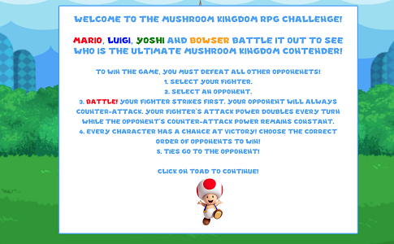
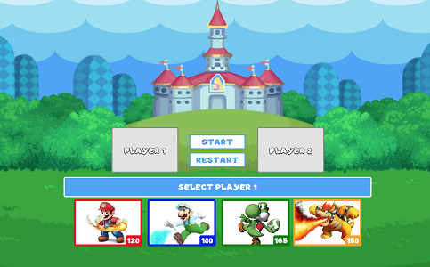
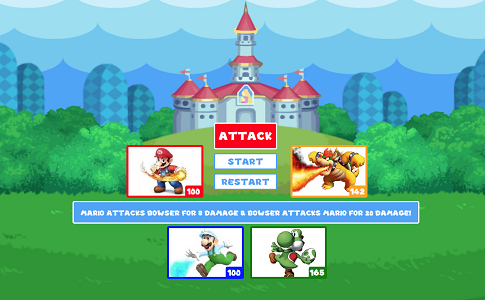
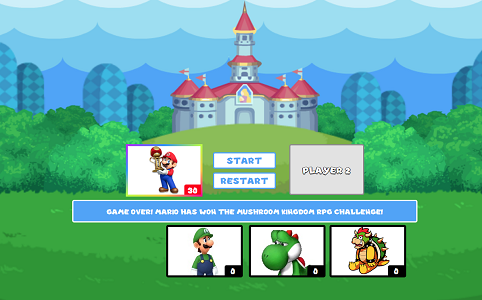
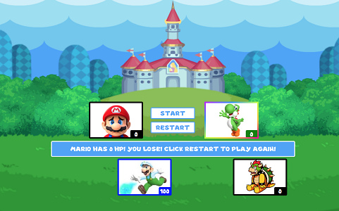

# The Mushroom Kingdom RPG Challenge!

[Link to the App](https://lii41333733.github.io/battle-game/)

## Introduction

King of the Hill! Be the last man standing in this role-playing game based on Super Mario Bros. Nintendo characters. To play, select a character who will be your fighter for the entirety of the game, then choose an opponent. After players are chosen, the battle phase begins. 

Your fighter strikes first and does so when the *Attack!* button is clicked, lowering your opponents health points. Your opponent will counter-attack, lowering your health points. Every turn, your chosen fighter's attack power doubles every turn while the opponent's attack power remains constant. Every player has a chance at victory, therefore it is up to you to choose the correct order in which to battle your opponents to win the game. All values are set in the game beforehand and ties go to the winner.

Look out for Bullet Bill on Mushroom Kingdom Hill!

## Proof of Concept

The main functionality of the battle game is the use of JQuery to manipulate the DOM interactively. Using JQuery make DOM Manipulation easier as its built-in methods help get the job done.

## Technologies Used
* HTML
* CSS
* JavaScript
* JQuery

## Screenshots

### Game Intro

### Choosing a Player

### Gameplay

### Player 1 Wins!

### Player 2 Wins!

